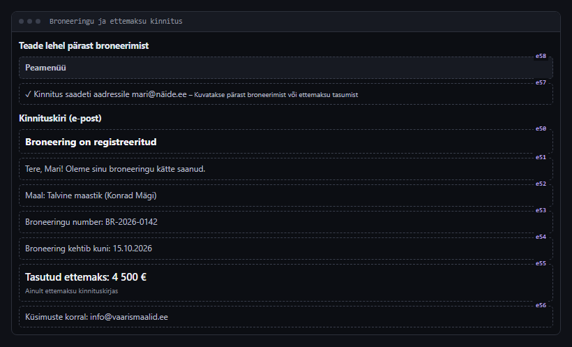
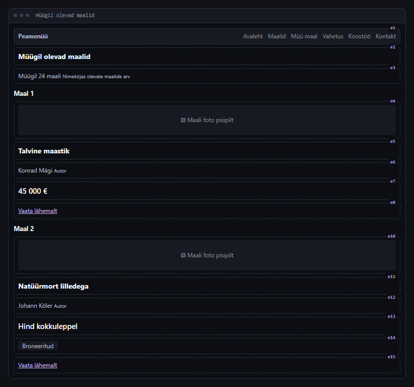
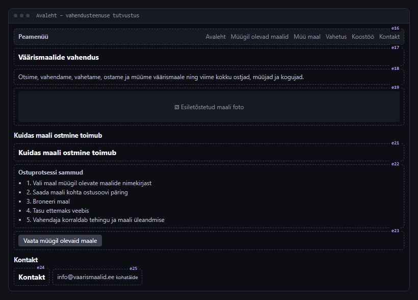
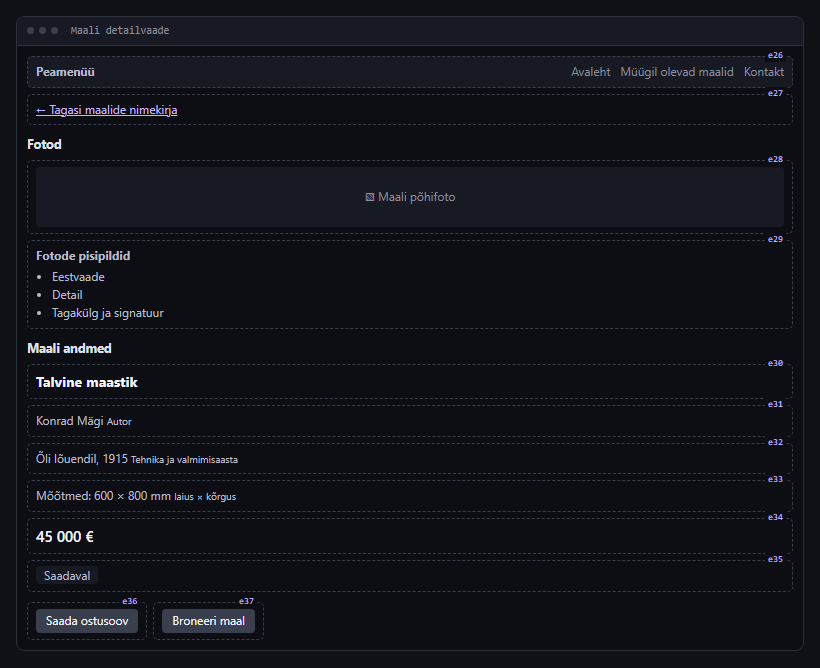
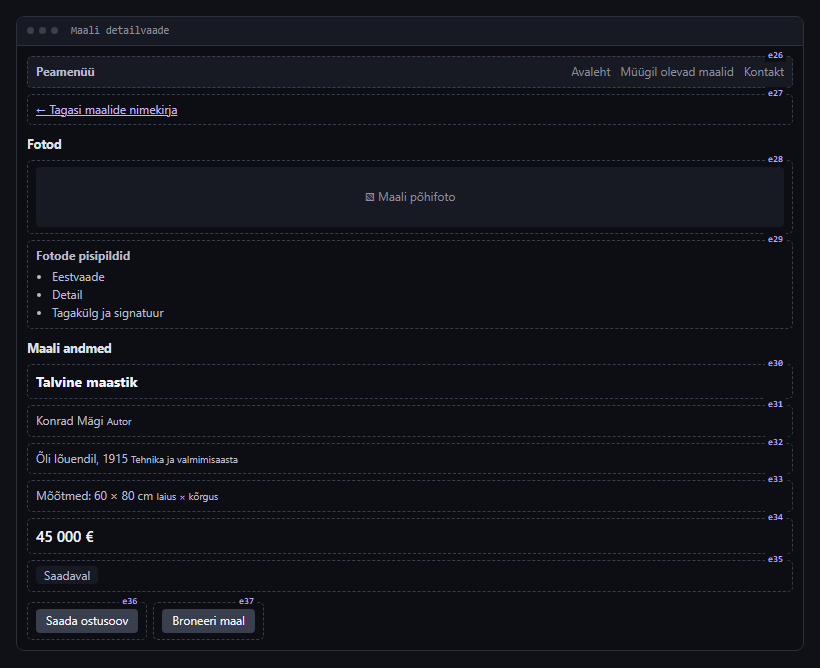
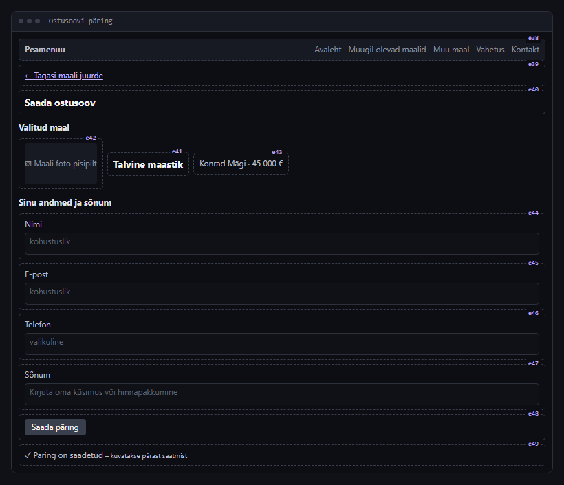
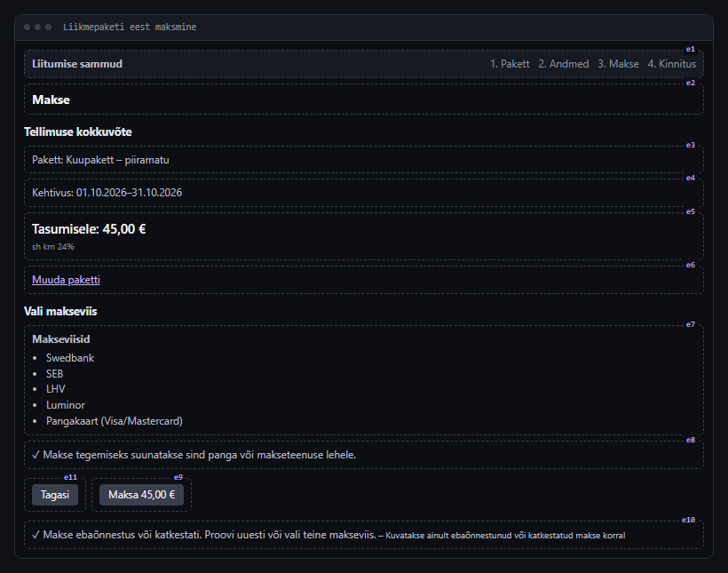

# Mockup'ide galerii

KickOff AI-ga loodud vaadete kavandid (mockup'id) koos kasutajalugude ja vastuvõtukriteeriumidega. Uuendatud 1.10.2026, 14:08:16.

Iga projekti kaustas on ka `galerii.html` (sama galerii brauseris avamiseks: laadi fail alla ja ava see, sh varasemad versioonid) ja `mockups.json` (kõik versioonid masinloetaval kujul). Pildil olevad lühikesed tunnused (e1, e2, …) on mockup'i elemendid, millele kriteeriumid viitavad.

## Projektid

- [Väärismaalide import/eksport](#väärismaalide-importeksport) – 5 mockup'iga lugu
- [Spordiklubi (päris AI)](#spordiklubi-päris-ai) – 1 mockup'iga lugu

## Väärismaalide import/eksport

otsin,vahendan,vahetan,müün ja ostan väärismaale
ja viin kokku erinevaid kliente

[Ava HTML-galerii](vaarismaalide-import-eksport/galerii.html) · [mockups.json](vaarismaalide-import-eksport/mockups.json)

### L7. Maali ostjana soovin saada broneeringu ja ettemaksu kohta kinnitus e-postiga, et olla kindel, et mu tehing on registreeritud.

Staatus: **Idee** · suurus: S · mockup v1

**Vastuvõtukriteeriumid**

- [ ] Pärast maali broneerimist kuvatakse lehel teade "Kinnitus saadeti aadressile" koos ostja e-posti aadressiga. `e57`
- [ ] Broneeringu kinnituskirja teemareal on tekst "Broneering on registreeritud". `e50`
- [ ] Kinnituskirjas on broneeritud maali pealkiri. `e52`
- [ ] Kinnituskirjas on broneeringu number. `e53`
- [ ] Kinnituskirjas on kuupäev, milleni broneering kehtib. `e54`
- [ ] Ettemaksu kinnituskirjas on tasutud ettemaksu summa eurodes. `e55`

### L2. Maali ostjana soovin sirvida müügil olevate maalide nimekirja, et leida endale huvipakkuvaid teoseid.

Staatus: **Idee** · suurus: M · mockup v1

**Vastuvõtukriteeriumid**

- [ ] Iga maali kaardil on maali foto pisipilt. `e4, e10`
- [ ] Iga maali kaardil on teose pealkiri. `e5, e11`
- [ ] Iga maali kaardil on autori nimi. `e6, e12`
- [ ] Iga maalil on hind `e7, e13`
- [ ] Broneeritud maali kaardil on märge "Broneeritud". `e14`
- [ ] Maali kaardil oleva lingi "Vaata lähemalt" klõpsamine avab selle maali detailvaate. `e8, e15`

### L1. Maali ostjana soovin lugeda avalehel vahendusteenuse tutvustust, et mõista, kuidas maali ostmine teenuse kaudu toimub.

Staatus: **Idee** · suurus: S · mockup v1

**Vastuvõtukriteeriumid**

- [ ] Avalehel on tutvustuse plokk pealkirjaga "Kuidas maali ostmine toimub". `e21`
- [ ] Ostuprotsess on tutvustuses kirjeldatud nummerdatud sammudena. `e22`
- [ ] Ostuprotsessi sammude hulgas on samm maali broneerimise kohta. `e22`
- [ ] Ostuprotsessi sammude hulgas on samm ettemaksu tasumise kohta. `e22`
- [ ] Nupu "Vaata müügil olevaid maale" klõpsamine avab müügil olevate maalide nimekirja. `e23`
- [ ] Avalehel on vahendaja e-posti aadress. `e25`

### L3. Maali ostjana soovin avada maali detailvaate fotode, autori, mõõtmete ja hinnaga, et otsustada, kas maal mulle sobib.

Staatus: **Idee** · suurus: M · mockup v2 (2 versiooni)

**Vastuvõtukriteeriumid**

- [ ] Detailvaates on maali põhifoto. `e28`
- [ ] Pisipildi klõpsamine fotode reas kuvab selle foto põhifoto asemel.
- [ ] Detailvaates on maali pealkiri.
- [ ] Detailvaates on autori nimi. `e31`
- [ ] Detailvaates on maali mõõtmed millimeetrites. `e33`
- [ ] Detailvaates on maali hind või märge "Hind kokkuleppel". `e34`
- [ ] Lingi "Tagasi maalide nimekirja" klõpsamine avab müügil olevate maalide nimekirja. `e27`

Varasemad versioonid

**v1** – AI ettepanek

### L4. Maali ostjana soovin saata valitud maali kohta ostusoovi päringut, et saada lisainfot või alustada hinnaläbirääkimist.

Staatus: **Idee** · suurus: M · mockup v1

**Vastuvõtukriteeriumid**

- [ ] Ostusoovi vormi kohal on valitud maali pealkiri. `e41`
- [ ] Vormil on kohustuslik väli "Nimi". `e44`
- [ ] Vormil on kohustuslik väli "E-post". `e45`
- [ ] Vormil on tekstiväli "Sõnum". `e47`
- [ ] Tühja välja "E-post" korral kuvab nupu "Saada päring" klõpsamine veateate "Sisesta e-posti aadress". `e45, e48`
- [ ] Pärast päringu saatmist kuvatakse teade "Päring on saadetud". `e49`

_Lisaks on 4 vaadet puudutavat lugu, millel mockup veel puudub._

## Spordiklubi (päris AI)

Vastuvõtukatse päris AI-ga

[Ava HTML-galerii](spordiklubi-paris-ai/galerii.html) · [mockups.json](spordiklubi-paris-ai/mockups.json)

### L6. Külastajana soovin maksta valitud liikmepaketi eest veebis, et saada liikmeks kohe, ilma klubisse minemata.

Staatus: **Idee** · suurus: L · mockup v1

**Vastuvõtukriteeriumid**

- [ ] Makse vaatel on näha valitud liikmepaketi nimi. `e3`
- [ ] Makse vaatel on näha makstav summa eurodes. `e5`
- [ ] Summa juures on märge, kas see sisaldab käibemaksu. `e5`
- [ ] Nupp „Maksa“ ei ole aktiivne enne, kui külastaja on valinud makseviisi. `e7, e9`
- [ ] Ebaõnnestunud või katkestatud makse korral kuvatakse makse vaatel veateade. `e10`
- [ ] Pärast õnnestunud makset on külastaja süsteemis märgitud valitud paketi liikmeks.

_Lisaks on 7 vaadet puudutavat lugu, millel mockup veel puudub._
